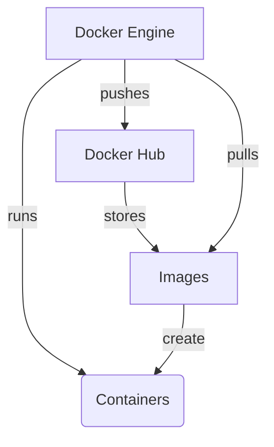

# 理解 Docker 概念

在开始使用 Docker 之前，让我们先熟悉一些关键概念。如果它们起初看起来很复杂，请不要担心 —— 我们很快就会看到它们的实际应用！

1. **容器（Container）**：一个轻量级、独立且可执行的软件包，包含运行某个软件所需的一切。
2. **镜像（Image）**：可以将其视为容器的模板或蓝图。它包含了创建容器所需的所有指令。
3. **Docker Hub**：类似于 Docker 镜像的 GitHub —— 你可以在这里查找和分享容器镜像。
4. **Docker Engine**：在你的机器上运行和管理容器的核心技术。

这是一个简单的图表，可以帮助你直观地了解这些概念是如何协同工作的：

该图表显示：

- Docker Engine 运行容器
- 镜像用于创建容器
- Docker Hub 存储镜像
- Docker Engine 可以从 Docker Hub 拉取（pull）镜像，也可以向 Docker Hub 推送（push）镜像

理解这些关系将有助于你在后续过程中掌握 Docker 的工作原理。点击下方的**继续**进入下一步！
